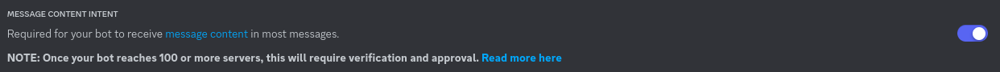

# ensata

discord LLM chatbot based on [servitor](https://github.com/dithercat/servitor)

## running

1. set up [basilisk](https://github.com/dithercat/basilisk)
   - text-generation-webui is also kind of supported; change `driver` to
     `textgen` and `endpoint` to `http://127.0.0.1:5000/api/v1/` in
     `config.json`
2. clone this repo somewhere
3. copy `config_example.json` to `config.json`, enter your bot token
4. `yarn` (or `npm install`) and `yarn start` (or `npm run start`)
5. ping the bot

## notes

- you need to enable the message content privileged intent in the discord dev
  portal
  
- the out-of-box prompt defines a catgirl AI simulacrum named "iris"
  - you can set the simulacrum's name and their initial "warmup" message with
    the `char` and `introduction` keys in config.json.
    - if the discord username differs from the simulacrum's name, it will
      automatically be corrected for consistency.
  - you can change the base preconditioning by creating a file called
    `/prompt.local` and editing that (ensata will try to load `/prompt.local`
    before falling back to `/prompt`).
    - you really shouldnt modify `/prompt` directly since it is committed and
      you might experience merge conflicts.
- this has absolutely nothing to do with the nintendo ds emulator of the same
  name
  - i was set on the name "iris" for the default simulacrum, but couldnt create
    a discord bot account with that name. the next thing that came to mind
    was "ensata", so i used that, and it seemed like a nice name for the
    software itself.